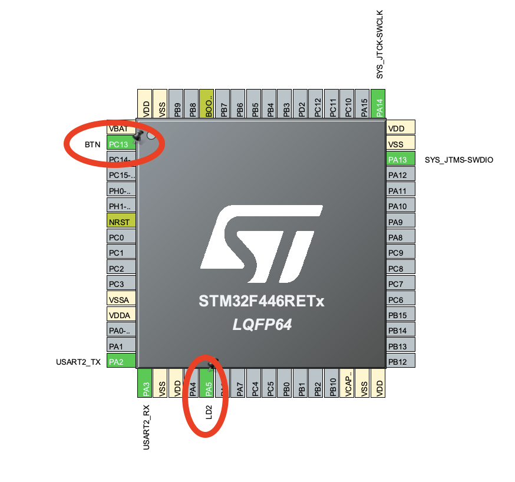

# Practica 4

El enunciado del ejercicio esta [acá](enunciado.md)

## Configuración

## Include Path

Agregar al include path `API/Inc`

### Pinout

1. Setear el label `LD2` para el PIN `GPIO:PA5` en `GPIO_Output`
1. Setear el label `BTN` para el PIN `GPIO:PC13` en `GPIO_EXTI13`
1. `GPO` -> `NVIC` -> EXTI Line Interrupt



## Documentación por Doxygen

La documentación por Doxygen se encuentra en [docs](docs/html/index.html) generada con:

```
doxygen Doxyfile
```

## Diagramas

### Diagrama de sequencia

```mermaid
sequenceDiagram
    participant MainLoop as Main Loop
    participant debounceFSM_update as debounceFSM_update
    participant HAL_GPIO_ReadPin as BTN_Pin
    participant delayRead as delayRead
    participant buttonPressed as buttonPressed
    participant buttonReleased as buttonReleased
    participant led as LD2_Pin

    MainLoop->>debounceFSM_update: Call debounceFSM_update()
    alt state == BUTTON_UP
        debounceFSM_update->>buttonReleased: Call buttonReleased() (BUTTON_UP state)
        buttonReleased->>led: HAL_GPIO_WritePin(GPIO_PIN_SET)
        debounceFSM_update->>HAL_GPIO_ReadPin: Read BTN_Pin (BUTTON_UP state)
        alt BTN_Pin == HIGH
            debounceFSM_update->>delayRead: Start delay (BUTTON_FALLING state)
        end
    end

    alt state == BUTTON_FALLING
        debounceFSM_update->>delayRead: Check delay (BUTTON_FALLING state)
        alt delayRead() == true
            debounceFSM_update->>HAL_GPIO_ReadPin: Read BTN_Pin (BUTTON_FALLING state)
        end
    end

    alt state == BUTTON_DOWN
        debounceFSM_update->>buttonPressed: Call buttonPressed() (BUTTON_DOWN state)
        buttonPressed->>led: HAL_GPIO_WritePin(GPIO_PIN_RESET)
        debounceFSM_update->>HAL_GPIO_ReadPin: Read BTN_Pin (BUTTON_DOWN state)
        alt BTN_Pin == LOW
            debounceFSM_update->>delayRead: Start delay (BUTTON_RAISING state)
        end
    end

    alt state == BUTTON_RAISING
        debounceFSM_update->>delayRead: Check delay (BUTTON_RAISING state)
        alt delayRead() == true
            debounceFSM_update->>HAL_GPIO_ReadPin: Read BTN_Pin (BUTTON_RAISING state)
        end
    end
```

### Diagrama de estado

```mermaid
stateDiagram-v2
    BUTTON_UP: BUTTON_UP buttonReleased()
    BUTTON_UP --> BUTTON_FALLING: BTN_Pin <- GPIO_PIN_SET
    BUTTON_UP --> BUTTON_UP: BTN_Pin <- GPIO_PIN_RESET

    BUTTON_DOWN: BUTTON_DOWN buttonPressed()
    BUTTON_DOWN --> BUTTON_RAISING: BTN_Pin <- GPIO_PIN_RESET
    BUTTON_DOWN --> BUTTON_DOWN: BTN_Pin <- GPIO_PIN_SET

    BUTTON_RAISING: 
    BUTTON_RAISING --> BUTTON_UP: delayRead() && <br> BTN_Pin <- GPIO_PIN_RESET
    BUTTON_RAISING --> BUTTON_DOWN: delayRead() && <br> BTN_Pin <- GPIO_PIN_SET

    BUTTON_FALLING: 
    BUTTON_FALLING --> BUTTON_DOWN: delayRead() && <br> BTN_Pin <- GPIO_PIN_SET
    BUTTON_FALLING --> BUTTON_UP: delayRead() && <br> BTN_Pin <- GPIO_PIN_RESET

```

